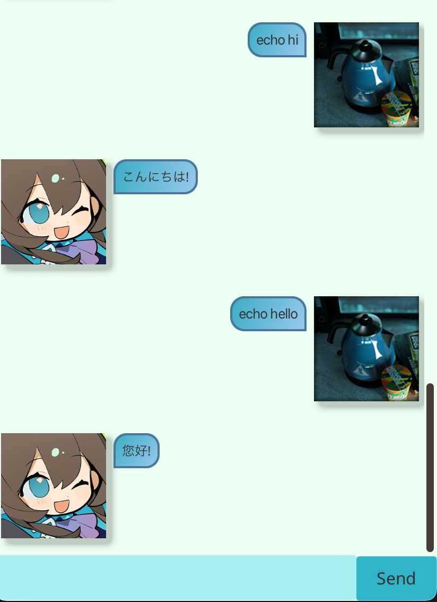
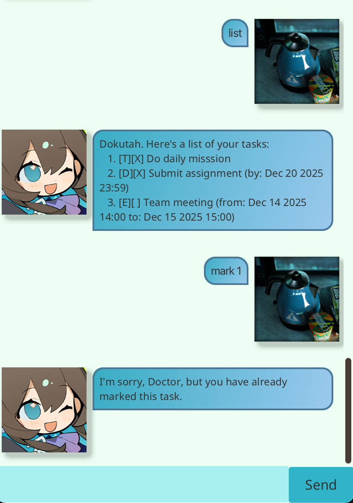

# Amiya

## Your cute, gentle daughter is now available as your chatbot
> There's still lots of work that needs to be done, Doctor. You can't rest now!

### Manage your tasks, talk with you, cook dinner for you!

Amiya is a chatbot and task manager that helps you keep track of your to-do list and also interacts with you in a cute and friendly manner! You can create tasks, mark them as done, and even talk to Amiya to stay motivated and focused.

---

## Features

- **Task Management**: Add, remove, mark, and unmark tasks.
- **Chat with Amiya**: Get cute greetings and interact with Amiya.
- **Task Scheduling**: Schedule tasks and set deadlines for better organization.
- **File Persistence**: Your tasks are saved to a file so you can continue where you left off.
- **Task Search**: Find specific tasks with a keyword.

---

## How to Run

To run the application, follow these simple steps:

1. **Clone the Repository**:
   First, clone this repository to your local machine:

   ```bash
   git clone https://github.com/vrisdng/ip.git
   cd ip
   ```
2. **Run the application**:
   ```./gradlew run```

## How to test
```./gradlew test```

## How to use

When you run the application, Amiya will greet you with a manual of what commands you can use.

Here are some example of commands that you might find useful:

- Task Example: Add a task with: ```todo Finish homework```

- Mark a task as done with: ```mark 1```

- Remove a task with: ```remove 1```

## Dependencies
- Java 8 or later
- Gradle (automatically handled by the wrapper)

## Sample images



