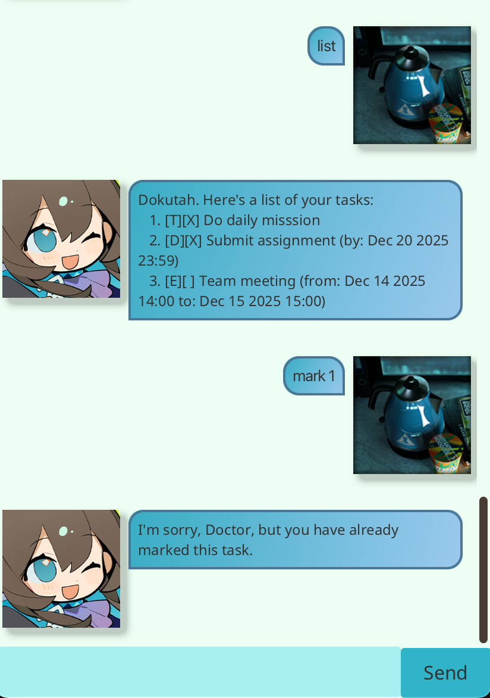

# Amiya

## Your cute, gentle daughter is now available as your chatbot
> There's still lots of work that needs to be done, Doctor. You can't rest now!

### Manage your tasks, talk with you, cook dinner for you!

Amiya is a chatbot and task manager that helps you keep track of your to-do list and also interacts with you in a cute and friendly manner! You can create tasks, mark them as done, and even talk to Amiya to stay motivated and focused.

---

## Features

- **Task Management**: Add, remove, mark, and unmark tasks.
- **Chat with Amiya**: Get cute greetings and interact with Amiya.
- **Task Scheduling**: Schedule tasks and set deadlines for better organization.
- **File Persistence**: Your tasks are saved to a file so you can continue where you left off.
- **Task Search**: Find specific tasks with a keyword.

## Echoing texts

Amiya can speak Japanese and Chinese when you say hi/hello to her by using "echo". Try ```echo thank you``` also!

## Adding a task 

Adds a task to the task list. There are 3 types of tasks available. Note the format.

# Todo

Format: ```todo <DESCRIPTION> ```

# Event

Format: ```event <DESCRIPTION> \by <dd-MM-yyyy>```

# Deadline

Format: ```deadline <DESCRIPTION> \from <dd-MM-yyyy> \to <dd-MMMM-yyyy>```

## Listing tasks

List the tasks in order of adding. 1-indexed. 

Format: ```list```

## Marking and unmarking a task

Format: ```mark <index of task>```

## Finding tasks

Find a task based on a given keyword. Tasks found will match the exact keyword.

Format: ```find <keyword>```

# View task schedule by date

Find tasks based on a given date. Tasks found will have dates exactly happen IN/DURING the given time.

Format: ```view dd-mm-yyyy```

## Removing tasks

Remove tasks based on indexes.

Format: ```remove <index of task>```

## Clearing all tasks

Delete all tasks from the list.

Format: ```clear```

## Saving and loading the data

Amiya automatically loads and saves your task lists to hard disk automatically after any command that changes the data. There is no need to save the data manually. 

---

## How to Run

To run the application, follow these simple steps:

1. **Clone the Repository**:
   First, clone this repository to your local machine:

   ```bash
   git clone https://github.com/vrisdng/ip.git
   cd ip
   ```
2. **Run the application**:
   ```./gradlew run```

## How to test
```./gradlew test```

## How to use

When you run the application, Amiya will greet you with a manual of what commands you can use.

Here are some example of commands that you might find useful:

- Task Example: Add a task with: ```todo Finish homework```

- Mark a task as done with: ```mark 1```

- Remove a task with: ```remove 1```

## Dependencies
- Java 8 or later
- Gradle (automatically handled by the wrapper)

## Sample images



